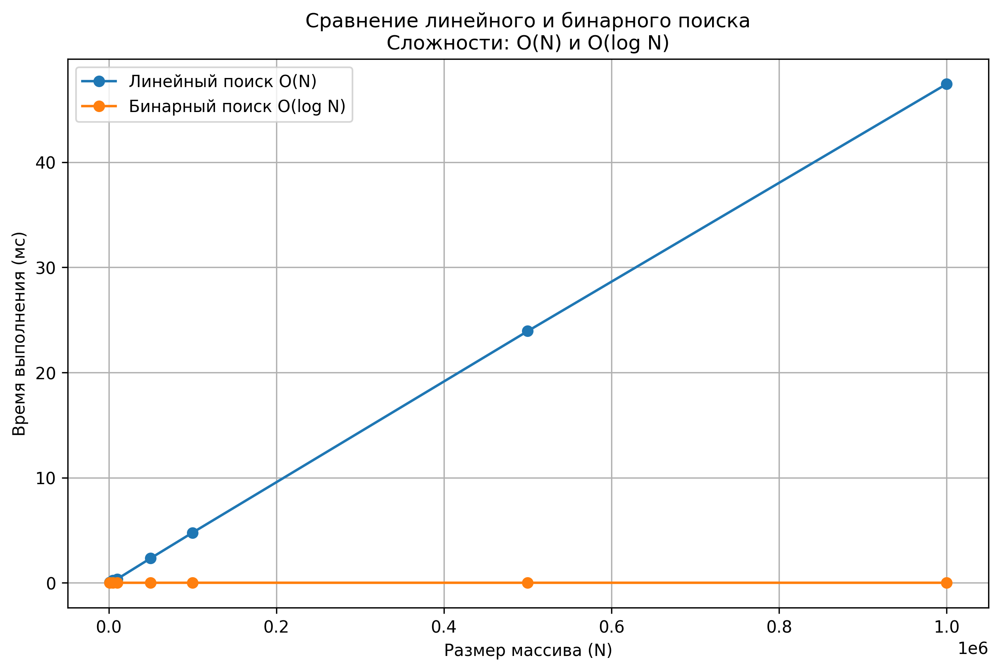
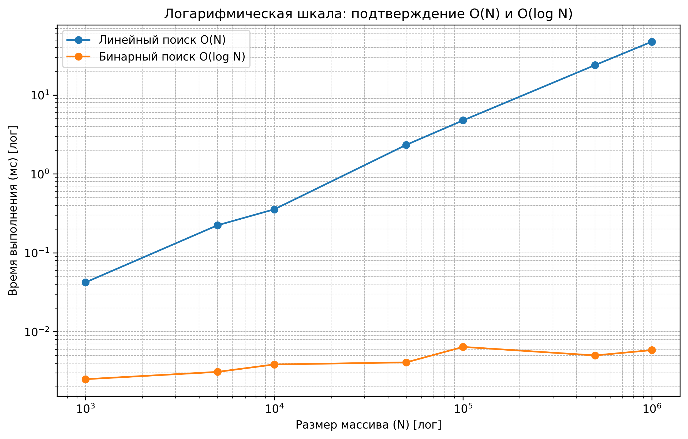

# Отчет по лабораторной работе №1  
# Введение в алгоритмы. Сложность. Поиск.

**Дата:** 2025-10-28  
**Семестр:** 5  
**Группа:** ПИЖ-б-о-23-1(1)  
**Дисциплина:** Анализ сложности алгоритмов  
**Студент:** Иванов Юрий Сергеевич

---

## Цель работы

Освоить понятие вычислительной сложности алгоритма.  
Получить практические навыки реализации и анализа линейного и бинарного поиска.  
Экспериментально подтвердить теоретические оценки сложности **O(N)** и **O(log N)**.

---

## Теоретическая часть

**Сложность алгоритма** — это количество ресурсов (времени и памяти), необходимых алгоритму для обработки входных данных объема *n*.  

**Асимптотический анализ** позволяет оценить поведение алгоритма при больших *n*, абстрагируясь от аппаратных особенностей и констант.  

**O-нотация ("О-большое")** — верхняя асимптотическая оценка, показывающая порядок роста функции.  

- **Линейный поиск (Linear Search)** — последовательный перебор элементов массива.  
  Сложность: **O(N)**.  

- **Бинарный поиск (Binary Search)** — поиск в отсортированном массиве методом деления пополам.  
  Сложность: **O(log N)**.  
  Требует предварительной сортировки массива.

---

## Практическая часть

### Выполненные задачи
- [x] Реализована функция `linear_search()` с построчными комментариями сложности.  
- [x] Реализована функция `binary_search()` с построчными комментариями сложности.  
- [x] Проведён теоретический анализ сложности обоих алгоритмов.  
- [x] Проведены экспериментальные замеры времени выполнения для разных размеров массивов.  
- [x] Проведено усреднение результатов и визуализация зависимостей.  
- [x] Построены графики в линейном и логарифмическом масштабах.  

---

### Ключевые фрагменты кода
```python
def linear_search(arr, target):
    """Линейный поиск элемента в массиве.
    Сложность: O(N)
    """
    for i in range(len(arr)):  # O(N)
        if arr[i] == target:   # O(1)
            return i           # O(1)
    return None                # O(1)
# Общая сложность: O(N)


def binary_search(arr, target):
    """Бинарный поиск элемента в отсортированном массиве.
    Сложность: O(log N)
    """
    left = 0                  # O(1)
    right = len(arr) - 1      # O(1)
    while left <= right:      # O(log N)
        mid = (left + right) // 2  # O(1)
        guess = arr[mid]           # O(1)
        if guess < target:         # O(1)
            left = mid + 1         # O(1)
        elif guess > target:       # O(1)
            right = mid - 1        # O(1)
        else:
            return mid             # O(1)
    return None                    # O(1)
# Общая сложность: O(log N)
```

---

## Результаты выполнения

### Характеристики ПК
- Процессор: 4 ядра  
- Оперативная память: 16 ГБ  
- ОС: Linux Mint  
- Python: 3.13.7  

---

### Пример работы программы
```bash
Характеристики ПК для тестирования:
- Процессор: 4 ядра
- Оперативная память: 16 ГБ
- ОС: Linux Mint
- Python: 3.13.7

Замеры времени выполнения:
    Размер              Тип элемента                  Алгоритм      Время (мс)
--------------------------------------------------------------------------------
      1000            Первый элемент       Линейный поиск O(N)          0.0016
      1000            Первый элемент   Бинарный поиск O(log N)          0.0047
      1000         Последний элемент       Линейный поиск O(N)          0.1384
      1000         Последний элемент   Бинарный поиск O(log N)          0.0079
      1000         Случайный элемент       Линейный поиск O(N)          0.0739
      1000         Случайный элемент   Бинарный поиск O(log N)          0.0046
      1000     Отсутствующий элемент       Линейный поиск O(N)          0.1307
      1000     Отсутствующий элемент   Бинарный поиск O(log N)          0.0051
      ...
```

---

### Визуализация результатов

**График 1.** Линейный масштаб  
(зависимость времени выполнения от размера массива)



**График 2.** Логарифмический масштаб  
(подтверждение асимптотик O(N) и O(log N))



---

## Анализ и выводы

1. Время выполнения **линейного поиска** растёт пропорционально размеру массива (*O(N)*).  
   Это особенно заметно при поиске последнего или отсутствующего элемента.  

2. **Бинарный поиск** показывает значительно меньший рост времени, соответствующий *O(log N)*.  
   Его производительность почти не зависит от размера массива в исследованном диапазоне.  

3. Экспериментальные данные полностью подтверждают теоретические оценки сложности.  

4. Усреднение по типам искомых элементов позволило сгладить случайные флуктуации и сделать графики более наглядными.  

---

## Заключение

В ходе лабораторной работы были реализованы и проанализированы два алгоритма поиска.  
Результаты экспериментов подтвердили различие в их временной сложности — **линейный поиск O(N)** и **бинарный поиск O(log N)**.  
Работа позволила на практике понять значение асимптотического анализа и способы экспериментальной проверки теоретических оценок.
