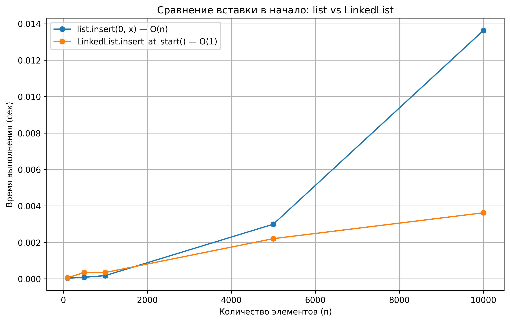
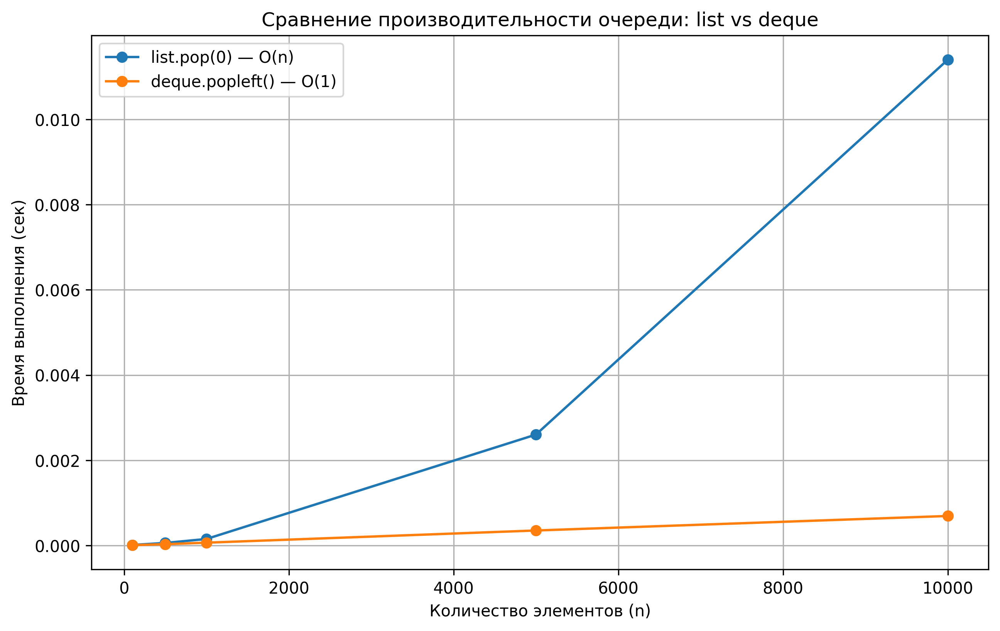

# Отчет по лабораторной работе №2  
# Основные структуры данных. Анализ и применение

**Дата:** 2025-10-30  
**Семестр:** 5
**Группа:** ПИЖ-б-о-23-1(1)  
**Дисциплина:** Анализ сложности алгоритмов  
**Студент:** Иванов Юрий Сергеевич

---

## 🎯 Цель работы

Изучить понятие и особенности базовых абстрактных типов данных (стек, очередь, дек, связный список) и их реализаций в Python.  
Научиться выбирать оптимальную структуру данных для решения конкретной задачи, основываясь на теоретической и практической сложности операций.  
Провести измерения производительности и подтвердить различия в эффективности между `list`, `deque` и собственной реализацией `LinkedList`.

---

## 🧠 Теоретическая часть

**Список (list):** динамический массив, обеспечивает O(1) доступ по индексу, но вставка/удаление в начало — O(n).  
**Связный список (LinkedList):** узлы с указателями, вставка/удаление в начало — O(1), но доступ по индексу — O(n).  
**Стек (Stack):** принцип LIFO, операции `push`, `pop` — O(1).  
**Очередь (Queue):** принцип FIFO, операции `enqueue`, `dequeue` — O(1) при использовании `deque`.  
**Дек (Deque):** двусторонняя очередь, эффективные вставка и удаление с обеих сторон — O(1).

---

## ⚙️ Практическая часть

### ✅ Выполненные задачи

- [x] Реализован класс `LinkedList` (вставка в начало/конец, удаление, обход)
- [x] Проведено сравнение производительности `list`, `LinkedList`, `deque`
- [x] Решены задачи:
  - Проверка сбалансированных скобок (Stack)
  - Очередь печати (Queue)
  - Проверка палиндрома (Deque)
- [x] Построены графики для анализа производительности
- [x] Добавлены характеристики ПК

---

## 🧩 Ключевые фрагменты кода

### 🔹 Реализация узла и связного списка

```python
class Node:
    """Класс узла связного списка."""

    def __init__(self, value):
        self.value = value
        self.next = None


class LinkedList:
    """Односвязный список с базовыми операциями."""

    def __init__(self):
        self.head = None
        self.tail = None

    def insert_at_start(self, value):
        """Вставка элемента в начало списка.
        Сложность: O(1)
        """
        new_node = Node(value)
        new_node.next = self.head
        self.head = new_node
        if self.tail is None:
            self.tail = new_node

    def insert_at_end(self, value):
        """Вставка элемента в конец списка.
        Сложность: O(1)
        """
        new_node = Node(value)
        if self.head is None:
            self.head = new_node
            self.tail = new_node
        else:
            self.tail.next = new_node
            self.tail = new_node

    def delete_from_start(self):
        """Удаление элемента из начала списка.
        Сложность: O(1)
        """
        if self.head is None:
            return None
        removed_value = self.head.value
        self.head = self.head.next
        if self.head is None:
            self.tail = None
        return removed_value

    def traversal(self):
        """Обход списка и вывод всех элементов.
        Сложность: O(n)
        """
        current = self.head
        elements = []
        while current is not None:
            elements.append(current.value)
            current = current.next
        return elements

    def __len__(self):
        """Подсчёт длины списка.
        Сложность: O(n)
        """
        length = 0
        current = self.head
        while current is not None:
            length += 1
            current = current.next
        return length

    def is_empty(self):
        """Проверка, пуст ли список.
        Сложность: O(1)
        """
        return self.head is None
```

---

### 🔹 Проверка сбалансированных скобок (stack)

```python
def is_balanced_brackets(s: str) -> bool:
    """
    Проверяет, сбалансированы ли скобки в строке.
    Используется стек (list), принцип LIFO.
    Сложность: O(n) по времени, O(n) по памяти.
    """
    stack = []
    pairs = {')': '(', ']': '[', '}': '{'}

    for char in s:
        if char in '([{':
            stack.append(char)
        elif char in ')]}':
            if not stack or stack[-1] != pairs[char]:
                return False
            stack.pop()

    return not stack
```

---

### 🔹 Очередь печати (queue)

```python
from collections import deque

def printer_queue(tasks: list):
    """
    Симулирует обработку заданий на печать.
    Используется очередь (deque), принцип FIFO.
    Сложность: O(n) по времени, O(n) по памяти.
    """
    queue = deque(tasks)
    step = 1

    while queue:
        current = queue.popleft()
        print(f"Шаг {step}: печатается '{current}'")
        step += 1
```

---

### 🔹 Палиндром (deque)

```python
from collections import deque

def is_palindrome(s: str) -> bool:
    """
    Проверяет, является ли строка палиндромом.
    Используется двусторонняя очередь (deque),
    чтобы эффективно сравнивать с обоих концов.
    Сложность: O(n) по времени, O(n) по памяти.
    """
    d = deque([char.lower() for char in s])

    while len(d) > 1:
        if d.popleft() != d.pop():
            return False

    return True
```

---

## 📈 Результаты экспериментов

### 📊 Сравнение операций вставки в начало (`list` vs `LinkedList`)
График показывает, что вставка в начало списка (`list.insert(0, x)`) линейно увеличивает время при росте N,  
в то время как `LinkedList.insert_at_start` выполняется стабильно за O(1).



---

### 📊 Сравнение операций удаления из начала (`list.pop(0)` vs `deque.popleft()`)
Удаление первого элемента у `list` требует сдвига всех элементов (O(n)),  
а `deque.popleft()` работает мгновенно — O(1).



---

## 💻 Пример вывода программы

```bash
=== Проверка сбалансированных скобок ===
{[()]}     -> True
{[(])}     -> False
((()))     -> True
[({})]     -> True
({[})      -> False

=== Симуляция очереди печати ===
Шаг 1: печатается 'Документ1'
Шаг 2: печатается 'Фото'
Шаг 3: печатается 'Отчет.pdf'

=== Проверка палиндромов ===
Аргентина манит негра     -> True
Level                     -> True
Python                    -> False
Madam                     -> True
```

---

## 🧮 Характеристики ПК

- **CPU:** 4 ядра  
- **RAM:** 16 ГБ  
- **ОС:** Linux Mint  
- **Python:** 3.11  

---

## 🧠 Анализ и выводы

1. Вставка в начало списка `list` занимает линейное время O(n), так как требуется сдвиг элементов.  
   У связного списка операция выполняется за O(1), что подтверждается экспериментом.
2. Для операций очереди структура `deque` значительно эффективнее списка,  
   так как поддерживает O(1) удаление и добавление с обеих сторон.
3. Практические задачи показали:
   - Стек удобен для проверки сбалансированности скобок (LIFO).
   - Очередь (deque) — идеальна для моделирования процессов (FIFO).
   - Дек — эффективное средство для проверки палиндромов.
4. Экспериментальные графики подтверждают теоретическую асимптотику.
