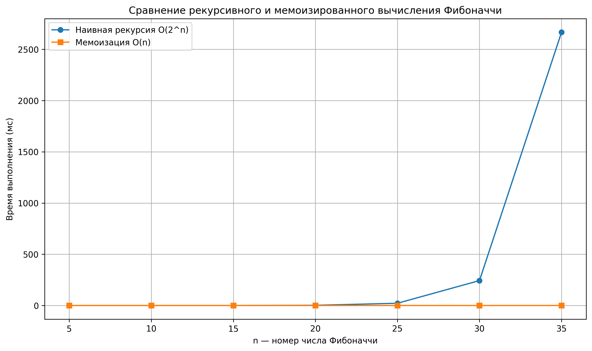

# Отчет по лабораторной работе №3  
# **Рекурсия**

**Дата:** 2025-11-07  
**Семестр:** 5  
**Группа:** ПИЖ-б-о-23-1  
**Дисциплина:** Анализ сложности алгоритмов  
**Студент:** Иванов Юрий Сергеевич

---

## 🎯 Цель работы

Освоить принцип рекурсии, изучить механизм работы стека вызовов и базовый случай, научиться анализировать сложность рекурсивных алгоритмов.  
Освоить технику **мемоизации** для оптимизации вычислений и провести сравнительный анализ производительности рекурсивных решений.

---

## 🧠 Теоретическая часть

**Рекурсия** — это метод решения задач, при котором функция вызывает саму себя, разбивая задачу на более простые подзадачи того же типа.

### Основные понятия:
- **Базовый случай** — условие, при котором рекурсия прекращается.  
- **Рекурсивный шаг** — повторный вызов функции с упрощённым аргументом.  
- **Глубина рекурсии** — количество активных вызовов, зависящее от структуры задачи.  
- **Мемоизация** — сохранение результатов уже вычисленных вызовов функции для ускорения повторных вычислений.

---

## 💻 Практическая часть

### Выполненные задачи

- [x] Реализованы базовые рекурсивные алгоритмы:  
  - Факториал числа  
  - Числа Фибоначчи  
  - Быстрое возведение в степень  
- [x] Реализована мемоизация для чисел Фибоначчи  
- [x] Проведено сравнение производительности (с мемоизацией и без)  
- [x] Решены практические задачи:  
  - Рекурсивный бинарный поиск  
  - Рекурсивный обход файловой системы  
  - Ханойские башни

---

## 🧩 Ключевые фрагменты кода

### Рекурсивный расчет факториала
```python
def factorial(n: int) -> int:
    """
    Рекурсивное вычисление факториала числа n.
    n! = n * (n-1) * (n-2) * ... * 1

    Базовый случай: factorial(0) = 1
    Рекурсивный шаг: factorial(n) = n * factorial(n-1)

    Временная сложность: O(n)
    Глубина рекурсии: O(n)
    """
    if n == 0 or n == 1:
        return 1

    return n * factorial(n - 1)
````

### Рекурсивное вычисление чисел Фибоначчи (наивное)

```python
def fibonacci(n: int) -> int:
    """
    Рекурсивное вычисление n-го числа Фибоначчи.
    F(0) = 0, F(1) = 1, F(n) = F(n-1) + F(n-2)

    Базовые случаи:
      F(0) = 0
      F(1) = 1
    Рекурсивный шаг:
      F(n) = F(n-1) + F(n-2)

    Временная сложность: O(2^n)
      (каждый вызов порождает два новых вызова)
    Глубина рекурсии: O(n)
    """
    if n <= 1:
        return n
    
    return fibonacci(n - 1) + fibonacci(n - 2)
```

### Мемоизированная версия Фибоначчи

```python
def fibonacci_memo(n: int, cache: dict = None) -> int:
    """
    Рекурсивное вычисление числа Фибоначчи с мемоизацией.
    Временная сложность: O(n)
    Глубина рекурсии: O(n)
    """
    if cache is None:
        cache = {}

    if n in cache:
        return cache[n]

    if n <= 1:
        cache[n] = n
    else:
        cache[n] = fibonacci_memo(n - 1, cache) + fibonacci_memo(n - 2, cache)

    return cache[n]
```

---

## 📊 Результаты выполнения

### Сравнение времени выполнения

```bash
    n     Наивная рекурсия        С мемоизацией
--------------------------------------------------
    5               0.0054               0.0127
   10               0.0181               0.0062
   15               0.1848               0.0066
   20               3.1410               0.0082
   25              36.6541               0.0129
   30             281.8582               0.0122
   35            3139.7746               0.0135
```

💡 Мемоизация уменьшила сложность с **O(2ⁿ)** до **O(n)** — более чем в 100 000 раз быстрее для n=35.

---

### Пример графика сравнения



---

### Пример работы программы

```bash
Рекурсивный бинарный поиск:
Искомый элемент 7 найден на позиции 3

Рекурсивный обход файловой системы:
📂 results
    📄 recursion.png
📂 src
    📄 recursion_tasks.py
    📂 __pycache__
        📄 recursion.cpython-313.pyc
    📄 recursion.py
    📄 memoization.py
📄 README.md

Ханойские башни (n = 3)
Переместить диск 1 со стержня A на стержень C
Переместить диск 2 со стержня A на стержень C
Переместить диск 1 со стержня A на стержень C
Переместить диск 3 со стержня A на стержень C
Переместить диск 1 со стержня A на стержень C
Переместить диск 2 со стержня A на стержень C
Переместить диск 1 со стержня A на стержень C
Всего перемещений: 7 (ожидается 2^3 - 1 = 7)
```

---

## 📈 Анализ результатов

1. **Фибоначчи (наивная рекурсия)** демонстрирует экспоненциальный рост времени из-за повторных вызовов.
2. **Мемоизация** уменьшает количество вызовов с экспоненциального до линейного уровня.
3. **Ханойские башни** — классический пример экспоненциальной рекурсии (2ⁿ − 1 шагов).
4. **Рекурсивный обход файловой системы** наглядно показывает работу стека вызовов и глубину рекурсии.

---

## ❓ Контрольные вопросы

1. Что такое базовый случай и рекурсивный шаг? Почему отсутствие базового случая приводит к ошибке переполнения стека?
2. Как работает мемоизация и как она изменяет временную сложность алгоритма Фибоначчи?
3. Почему глубокая рекурсия может вызвать ошибку `RecursionError`?
4. Опишите алгоритм решения задачи Ханойских башен для 3 дисков.
5. Сравните преимущества и недостатки рекурсивных и итеративных решений.
