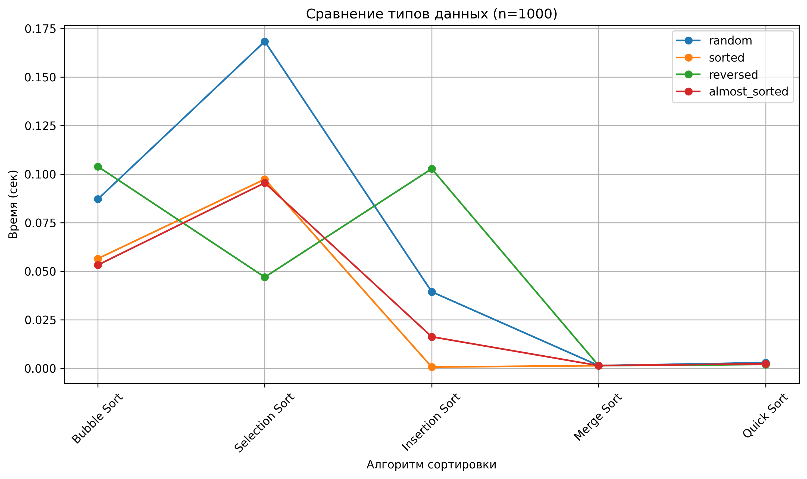
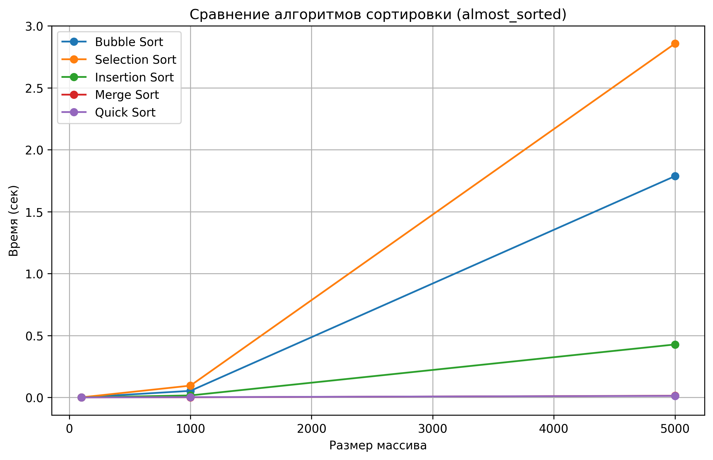

# Отчет по лабораторной работе №4  
# Алгоритмы сортировки

**Дата:** 2025-11-17  
**Семестр:** 5  
**Группа:** ПИЖ-б-о-23-1  
**Дисциплина:** Анализ сложности алгоритмов  
**Студент:** Иванов Юрий Сергеевич  

## Цель работы
Изучить и реализовать основные алгоритмы сортировки; провести теоретический и практический сравнительный анализ их эффективности; исследовать влияние начальной упорядоченности данных.

## Теоретическая часть
Кратко описать алгоритмы: Bubble, Selection, Insertion, Merge, Quick. Указать временную и пространственную сложность в худшем/среднем/лучших случаях и устойчивость.

## Практическая часть
1. Реализованы алгоритмы в `sorts.py`.
2. Подготовлены тестовые наборы данных в `generate_data.py`.
3. Замеры производительности — `performance_test.py`. Результаты сохранены в `sorts_performance.csv`.
4. Визуализация результатов — `plot_results.py` (получены `time_vs_size_random.png` и `time_vs_type_nXXXX.png`).

## Ключевые фрагменты кода
```python
def bubble_sort(arr: list[int]) -> list[int]:
    """Пузырьковая сортировка.
    Время (худ/сред/луч): O(n^2) / O(n^2) / O(n^2)
    Память: O(1) дополнительной (in-place)
    Стабильность: стабильна
    """
    a = arr.copy()
    n = len(a)

    for i in range(n):
        for j in range(n - 1 - i):
            if a[j] > a[j + 1]:
                a[j], a[j + 1] = a[j + 1], a[j]

    return a


def selection_sort(arr: list[int]) -> list[int]:
    """Сортировка выбором.
    Время (худ/сред/луч): O(n^2) / O(n^2) / O(n^2)
    Память: O(1) дополнительной (in-place)
    Стабильность: неустойчива (обычно)
    """
    a = arr.copy()
    n = len(a)

    for i in range(n):
        min_idx = i
        for j in range(i + 1, n):
            if a[j] > a[min_idx]:
                min_idx = j
            if min_idx != i:
                a[i], a[min_idx] = a[min_idx], a[i]

    return a


def insertion_sort(arr: list[int]) -> list[int]:
    """Сортировка вставками.
    Время (худ/сред/луч): O(n^2) / O(n^2) / O(n)
    Память: O(1) дополнительной (in-place)
    Стабильность: стабильна
    Эффективна для маленьких/почти отсортированных массивов.
    """
    a = arr.copy()

    for i in range(1, len(a)):
        key = a[i]
        j = i - 1
        while j >= 0 and a[j] > key:
            a[j + 1] = a[j]
            j -= 1
        a[j + 1] = key

    return a


def merge_sort(arr: list[int]) -> list[int]:
    """Сортировка слиянием (рекурсивная).
    Время (худ/сред/луч): O(n log n) / O(n log n) / O(n log n)
    Память: O(n) дополнительной (для хранения временных массивов)
    Стабильность: стабильна
    """
    if len(arr) <= 1:
        return arr.copy()

    mid = len(arr) // 2
    left = merge_sort(arr[:mid])
    right = merge_sort(arr[:mid])
    merged = []
    i = 0
    j = 0

    while i < len(left) and j < len(right):
        if left[i] <= right[j]:
            merged.append(left[i])
            i += 1
        else:
            merged.append(right[j])
            j += 1

    if i < len(left):
        merged.extend(left[i:])
    if j < len(right):
        merged.extend(right[j:])

    return merged


def quick_sort(arr: list[int]) -> list[int]:
    """
    Быстрая сортировка (Quick Sort).
    Время (худ/сред/луч): O(n log n) / O(n log n) / O(n^2)
    Память: O(n log n) — новая память выделяется на каждом уровне рекурсии.
    Стабильность: стабильна
    """
    if len(arr) <= 1:
        return arr.copy()

    pivot = arr[len(arr) // 2]
    left = [x for x in arr if x < pivot]
    middle = [x for x in arr if x == pivot]
    right = [x for x in arr if x > pivot]

    return quick_sort(left) + middle + quick_sort(right)
```

## Результаты



## Анализ и выводы
- Bubble/Selection/Insertion — O(n^2), плохо масштабируются, но insertion эффективен для почти отсортированных данных.
- Merge Sort — стабильная O(n log n), требует O(n) доп. памяти.
- Quick Sort — лучший выбор в среднем случае (O(n log n)), но опасен на обратносортированных данных при плохом выборе опорного (поэтому используем медиану из 3).
- Рекомендации по использованию алгоритмов в зависимости от размера и типа данных.

## Характеристики ПК
- CPU: 4 ядра  
- RAM: 16 ГБ  
- ОС: Linux Mint  
- Python: 3.13
