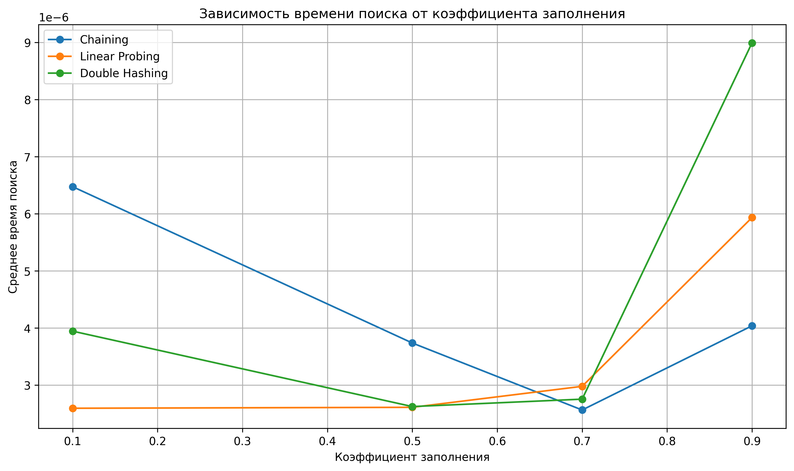
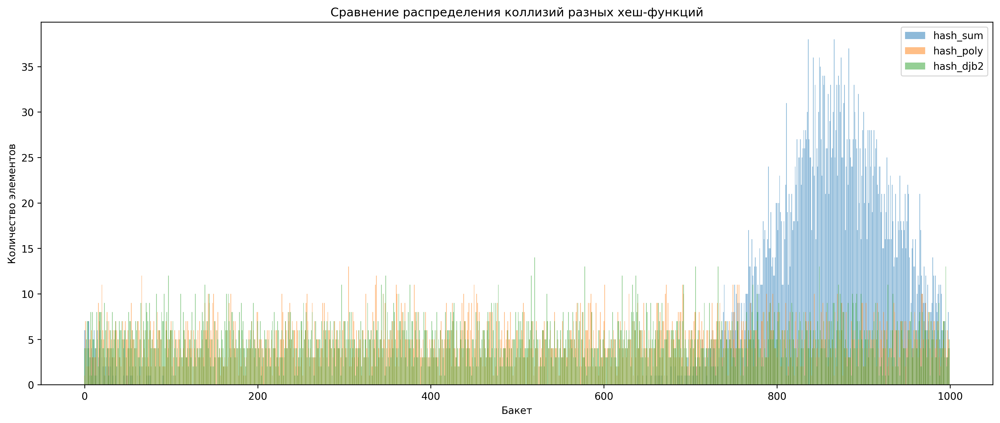

# **Отчёт по лабораторной работе №5**

# **Хеш-таблицы и анализ методов разрешения коллизий**

**Дата:** 2025-11-23  
**Семестр:** 5  
**Группа:** ПИЖ-б-о-23-1  
**Дисциплина:** Анализ сложности алгоритмов  
**Студент:** Иванов Юрий Сергеевич  

---

# **Цель работы**

Реализовать и сравнить различные методы организации хеш-таблиц, исследовать влияние коэффициента загрузки на производительность, изучить влияние качества хеш-функций на количество коллизий и построить визуализации результатов.

---

# **Практическая часть**

### Реализация структур данных (`hash_table_chaining.py`, `hash_table_open_addressing.py`)

Реализованы классы:

```
HashTableChaining
HashTableLinear
HashTableDoubleHashing
```

Каждый поддерживает методы:

* `insert(key, value)`
* `search(key)`
* `delete(key)`

---

#### **1. Зависимость времени от коэффициента загрузки**



#### **2. Гистограммы распределения коллизий**



---

# **Анализ и выводы**

### **1. Метод цепочек**

* стабилен при росте загрузки
* сильно зависит от качества хеш-функции
* показывает предсказуемое поведение

### **2. Линейное пробирование**

* быстрое при малых α
* при α > 0.7 резко деградирует
* сильное скопление коллизий

### **3. Двойное хеширование**

* минимальные коллизии
* лучшая масштабируемость
* чувствительно к выбору вторичной хеш-функции

### **4. Хеш-функции**

* `hash_sum` → множество коллизий → плохая производительность
* `hash_poly` → ровное распределение
* `hash_djb2` → минимальное число коллизий, лучшая практическая скорость

---

# **Характеристики ПК**

* CPU: 4 ядра
* RAM: 16 ГБ
* ОС: Linux Mint
* Python: 3.13

---

# **Вывод**

Работа выполнена. Исследованы:

* три метода разрешения коллизий
* три хеш-функции
* влияние коэффициента загрузки
* распределение коллизий
* поведение таблиц в реальных условиях

Получены визуализации, подтверждающие теоретические оценки.
