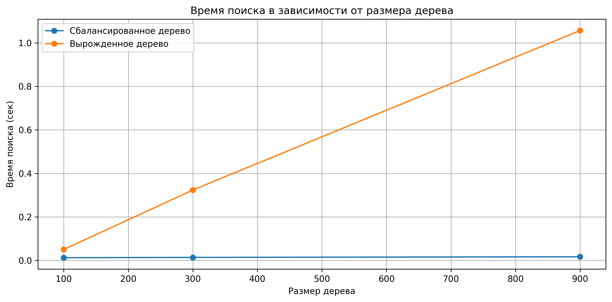
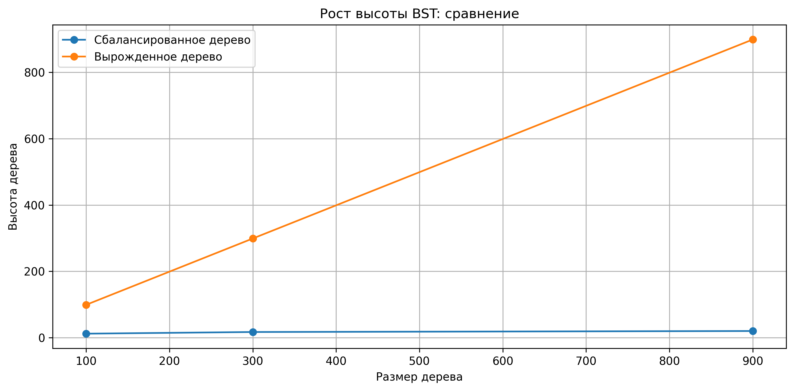

# 📘 Лабораторная работа №6

## **Бинарные деревья поиска (BST)**

**Дисциплина:** Анализ сложности алгоритмов  
**Студент:** Иванов Юрий Сергеевич  
**Группа:** ПИЖ-б-о-23-1  
**Дата:** 2025-11-30  

---

## 🎯 **Цель работы**

Изучить принципы построения бинарного дерева поиска (BST), реализовать основные операции над деревом, исследовать влияние порядка вставки на структуру дерева и время поиска.

---

## 🛠 **Практическая часть**

### В ходе работы реализовано:

### **Класс `BinarySearchTree`**

Методы:

* `insert(x)` — рекурсивная вставка
* `search(x)` — рекурсивный поиск
* `delete(x)` — удаление узла
* `height()` — вычисление высоты
* `find_min()` — вычисление минимума
* `find_max()` — вычисление максимума
* `is_valid_bst()` — проверка бинарного дерева

---

## 🔬 **Экспериментальное исследование**

В файле **`analysis.py`** проведено сравнение:

### ✔ Сбалансированного дерева

→ элементы вставляются в случайном порядке

### ✔ Вырожденного дерева

→ элементы вставляются в отсортированном порядке

Для трёх размеров: `100`, `300`, `900`
Для каждого замерено:

* время поиска (1000 операций)
* высота дерева

Также построены два графика:

* время поиска vs. размер дерева

* высота дерева vs. размер дерева

---

## 🧠 **Выводы**

1. Порядок вставки **радикально** влияет на высоту BST.
2. Случайная вставка даёт почти сбалансированное дерево с глубиной `≈ log₂(n)`.
3. Вырожденное дерево имеет высоту `n − 1` и работает как связный список.
4. Время поиска в вырожденном дереве растёт **линейно**, что подтверждается экспериментами.
5. Для реальных задач рекомендуется использовать самобалансирующиеся деревья (AVL, Red-Black).

---

## 💻 **Технические характеристики**

* Python 3.14
* ОС: Windows 10
* CPU: 4 ядра
* RAM: 16 ГБ
