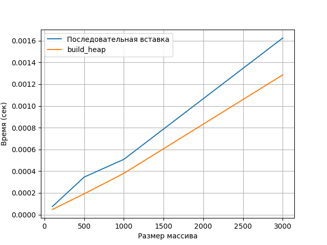
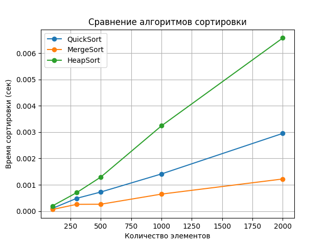

# Отчет по лабораторной работе №7

# Кучи (Heaps)

**Дата:** 2025-12-14  
**Семестр:** 5  
**Группа:** ПИЖ-б-о-23-1  
**Дисциплина:** Анализ сложности алгоритмов  
**Студент:** Иванов Юрий Сергеевич  

---

## Цель работы

Изучить структуру данных «куча» (heap), её свойства и способы реализации на основе массива.
Освоить основные операции с кучей (вставка, извлечение корня, построение кучи), реализовать алгоритм пирамидальной сортировки (Heapsort) и приоритетную очередь.
Провести экспериментальное сравнение Heapsort с быстрой сортировкой и сортировкой слиянием.

---

## Теоретическая часть

**Куча (Heap)** — это специализированная структура данных, представляющая собой полное бинарное дерево, удовлетворяющее свойству кучи.

* **Min-Heap:** значение в каждом узле меньше или равно значениям его потомков
* **Max-Heap:** значение в каждом узле больше или равно значениям его потомков

Куча эффективно реализуется на основе массива:

* Родитель: `(i - 1) // 2`
* Левый потомок: `2 * i + 1`
* Правый потомок: `2 * i + 2`

## Практическая часть

### Реализация кучи

В файле `heap.py` реализована min-куча на основе массива со следующими методами:

* `insert(value)`
* `extract()`
* `peek()`
* `build_heap(array)`
* `_sift_up(index)`
* `_sift_down(index)`

Для каждого метода в коде указана временная сложность.

---

### Heapsort

В файле `heapsort.py` реализованы:

* Версия Heapsort с использованием отдельной кучи
* In-place версия Heapsort без дополнительной памяти

---

### Приоритетная очередь

В файле `priority_queue.py` реализован класс `PriorityQueue`, использующий кучу:

* `enqueue(item, priority)`
* `dequeue()`

Очередь извлекает элемент с **наивысшим приоритетом** (минимальное значение приоритета).

---

## Тестирование

Для тестирования используется **pytest**.

Запуск тестов:

```bash
pytest -v
```

---

## Экспериментальное исследование

Проведены замеры:

1. Построение кучи:

   * последовательная вставка
   * алгоритм `build_heap`



2. Сравнение сортировок:

   * Heapsort
   * QuickSort
   * MergeSort



Замеры выполнялись на одной вычислительной машине.

---

## Выводы

* Куча — эффективная структура данных для реализации приоритетной очереди.
* Алгоритм `build_heap` является оптимальным способом построения кучи.
* Heapsort гарантирует стабильную асимптотическую сложность, но уступает QuickSort по скорости на практике.
* Использование кучи оправдано в задачах, где важны гарантии по времени и памяти.

---

## Характеристики ПК

* CPU: 4 ядра
* RAM: 16 ГБ
* ОС: Linux Mint
* Python: 3.13
