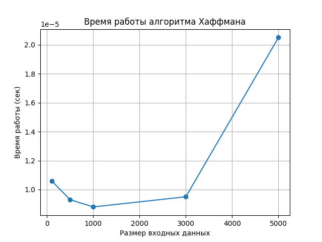

# Отчет по лабораторной работе №8

# Жадные алгоритмы

**Дата:** 2025-12-15  
**Семестр:** 5  
**Группа:** ПИЖ-б-о-23-1  
**Дисциплина:** Анализ сложности алгоритмов  
**Студент:** Иванов Юрий Сергеевич  

---

## Цель работы

Изучить жадный метод проектирования алгоритмов, основанный на принятии локально оптимальных решений. Освоить применение жадных алгоритмов для решения классических задач, проанализировать корректность жадного выбора и выявить ограничения данного подхода на примере задачи о рюкзаке.

---

## Теоретическая часть

**Жадный алгоритм** — это алгоритм, который на каждом шаге выбирает локально оптимальное решение без учёта последствий для будущих шагов, предполагая, что итоговое решение окажется глобально оптимальным.

Жадный подход корректен для задач, обладающих:

* свойством жадного выбора;
* оптимальной подструктурой.

Однако жадные алгоритмы **не всегда гарантируют оптимальное решение**.

---

## Реализованные алгоритмы

### 1. Задача о выборе заявок (Interval Scheduling)

Жадная стратегия:
выбор интервала с **минимальным временем окончания**.

* Сложность: **O(n log n)**
* Корректность: раннее завершение интервала оставляет максимум пространства для следующих.

---

### 2. Задача о рюкзаке (0-1 Knapsack, жадный)

Предмет либо берётся **целиком**, либо не берётся вовсе.

Жадная стратегия:

* сортировка по удельной стоимости `value / weight`.

* Сложность: **O(n log n)**

* Корректность: **не гарантируется**, используется для демонстрации ограничений жадного подхода.

---

### 3. Алгоритм Хаффмана

Жадная стратегия:

* на каждом шаге объединяются **два символа с минимальной частотой**.

* Сложность: **O(n log n)**

* Корректность: минимизирует среднюю длину кодов.

Реализованы:

* построение дерева Хаффмана;
* генерация кодов;
* текстовая визуализация дерева.

---

### 4. Задача о размене монет

Жадная стратегия:

* выбор наибольшей возможной монеты на каждом шаге.

* Сложность: **O(n)**

* Корректность: гарантируется **только для стандартных систем монет**.

---

### 5. Минимальное остовное дерево (алгоритм Краскала)

Жадная стратегия:

* добавление рёбер с минимальным весом без образования циклов.

* Сложность: **O(E log E)**

* Корректность: доказана для MST-задач.

---

## Практическая часть

## Сравнительный анализ рюкзака

Проведено сравнение:

* жадного алгоритма для 0-1 рюкзака;
* точного решения.

**Вывод:**
жадный алгоритм может давать **неоптимальное решение** в дискретной версии задачи о рюкзаке.

---

## Экспериментальное исследование

Проведены замеры времени работы алгоритма Хаффмана для входных данных различного размера.

* Использовалась функция `time.perf_counter`
* Все эксперименты выполнены на одной вычислительной машине

Построен график зависимости времени выполнения от количества символов.


---

## Визуализация

### Дерево Хаффмана (текстовая)

Пример вывода:

```
└── * (100)
    ├── 'f' (45)
    └── * (55)
        ├── 'c' (12)
        └── 'd' (13)
```

График зависимости времени работы алгоритма Хаффмана от размера входных данных построен в `analysis.py`.

---

## Анализ и выводы

* Жадные алгоритмы эффективны и просты в реализации.
* Они корректны только для задач с оптимальной подструктурой.
* Задача о 0-1 рюкзаке демонстрирует ограниченность жадного подхода.
* Алгоритм Хаффмана является классическим примером корректного жадного алгоритма.
* Для сложных задач необходимо выбирать подходящий метод (жадный, ДП, перебор).

---

## Характеристики ПК

* **CPU:** 4 ядра
* **RAM:** 16 ГБ
* **ОС:** Linux Mint
* **Python:** 3.13
